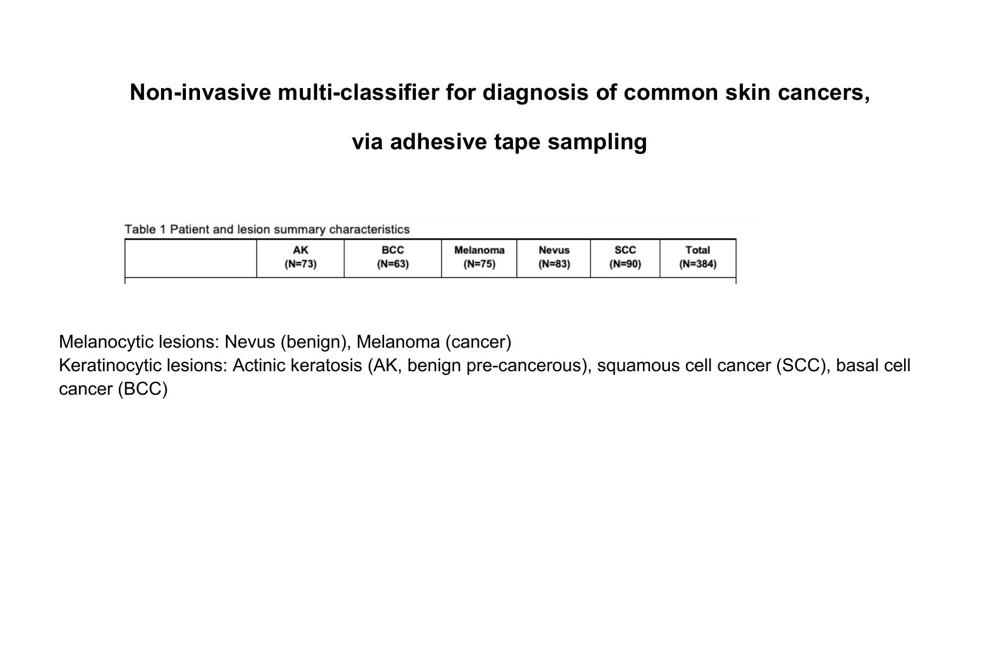
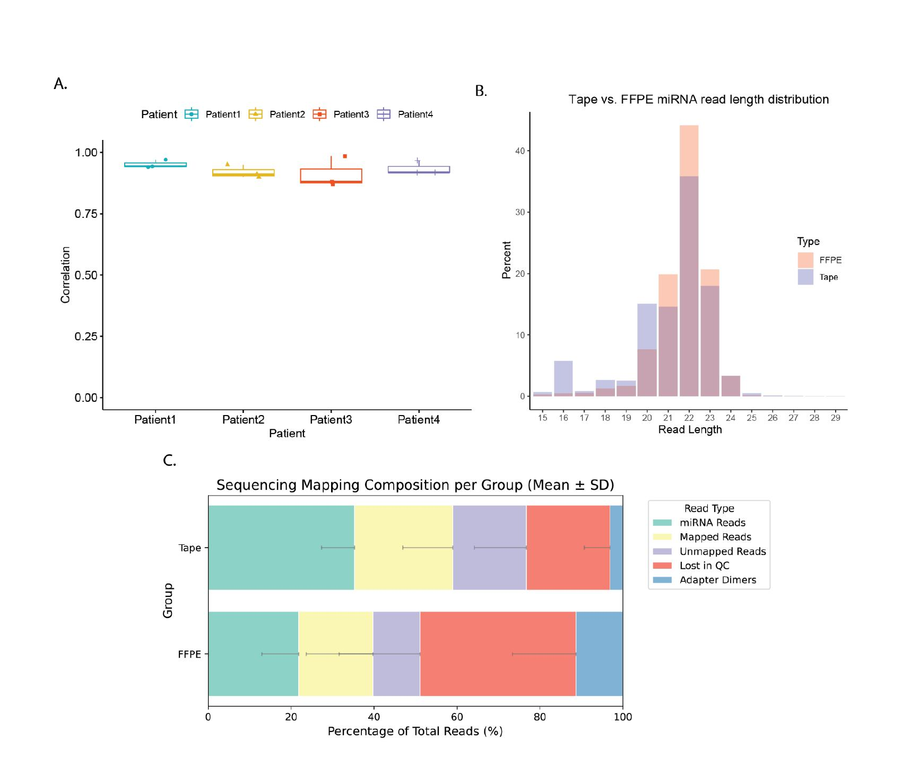
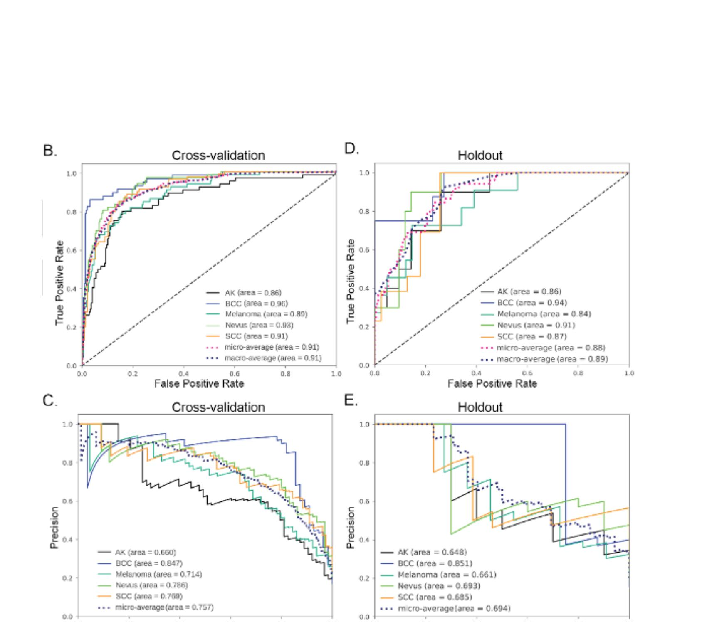
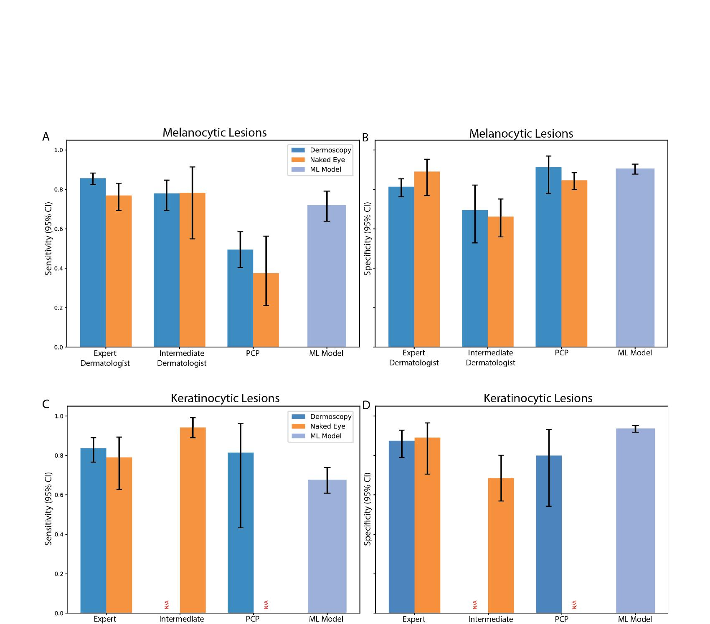
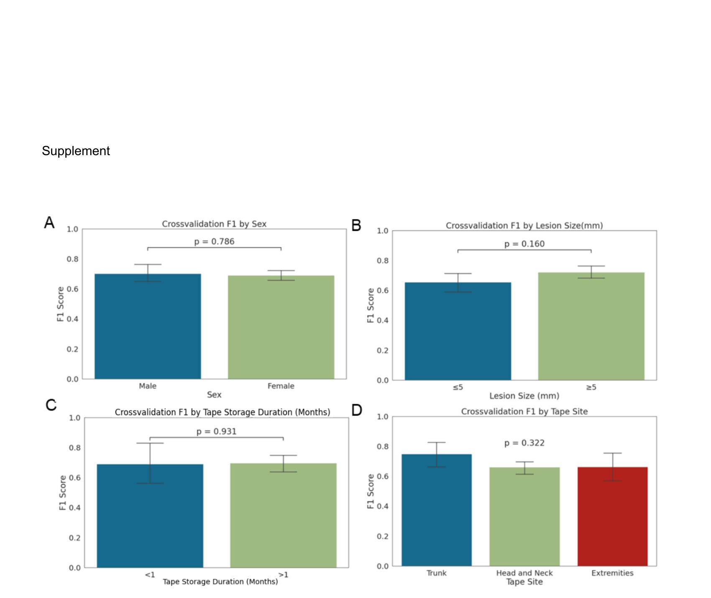
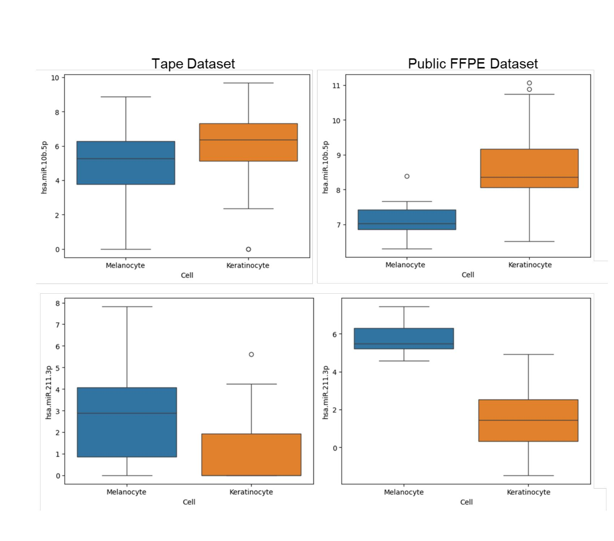

# Study Overview {data-background="#111"}

## Lesion Types

**Melanocytic lesions**

- Nevus (benign)
- Melanoma (cancer)

**Keratinocytic lesions**

- Actinic keratosis (AK, benign pre-cancerous)
- Squamous cell cancer (SCC)
- Basal cell cancer (BCC)

## Table 1: Patient and Lesion Summary Characteristics

| AK (N=73) | BCC (N=63) | Melanoma (N=75) | Nevus (N=83) | SCC (N=90) | **Total (N=384)** |
|-----------|-----------|----------------|-------------|-----------|-----------------|

**Annotations:**

---

# Figure 1: Tape Collected miRNA Reproducibility and Stability

**A)** Average Spearman correlation for miRNA collected by serial tape sampling of single nevi on different individuals.
**B)** Read length distribution: FFPE (pink) vs. tape sampling (blue) miRNA.
**C)** Sequencing mapping composition -- tape samples show higher miRNA reads and fewer adapter dimers than FFPE.

**Annotations:**

---

# Figure 2: Model Development and Performance

**B)** AUROC cross-validation on training data.
**C)** Precision-recall curve, cross-validation on training data.
**D)** AUROC on hold-out data.
**E)** Precision-recall curve on hold-out data.
AK = actinic keratosis; SCC = squamous cell cancer; BCC = basal cell cancer.

**Annotations:**

---

# Figure 4: Model Performance vs. Clinicians

Sensitivity and specificity for the classifier vs. experienced dermatologists (>2 yrs), inexperienced dermatologists (<2 yrs), and PCPs with (blue) or without (green) a dermatoscope.
**A/B)** Melanocytic samples (nevus, melanoma).
**C/D)** Keratinocytic samples (AK, SCC, BCC).

**Annotations:**

---

# Supplement Figure 2: Cross-Validation F1 by Sample Characteristics

F1 score compared across sample subsets. No significant difference observed by:
**A)** Patient sex (p=0.786)  **B)** Lesion size (p=0.160)  **C)** Tape storage duration (p=0.931)  **D)** Tape collection site (p=0.322).
P values by T-test (two groups) or ANOVA (three groups).

**Annotations:**

---

# Supplement Figure 3: Differential miRNA Expression in Tape vs. Public Datasets

miR-10b-5p and miR-211-3p are differentially expressed in a similar manner in both tape samples and reanalyzed public FFPE datasets when comparing melanocytic and keratinocytic lesions.

**Annotations:**

<!-- To run
# nohup Rscript -e "knitr::knit2html('Wei_Figs.Rmd')" > Wei_Figs.log  &
    
# Or
# nohup Rscript -e "rmarkdown::render('Wei_Figs.Rmd')" > Wei_Figs.log  &

-->

